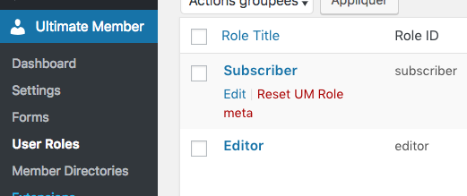
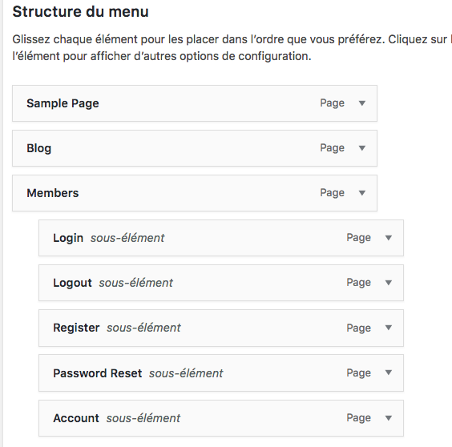
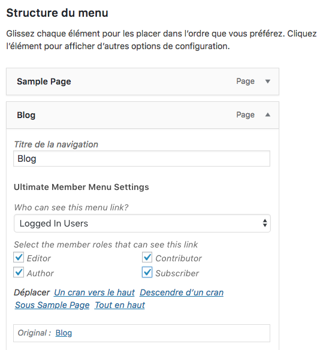
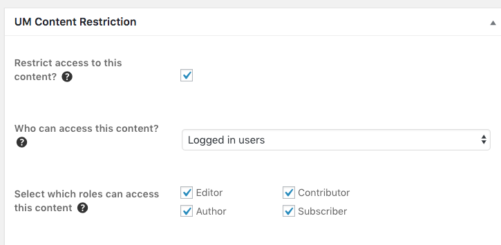

# Créer un espace membre sur wordpress

Avant de vous lancer, sachez qu’un espace de membres requiert une certaine performance de la part de votre hébergement. D’autant que pour garantir la sécurité des données qui sont échangées sur votre site web, vous devrez recourir à un certificat SSL (Secure Socket Layer). Ce certificat permet de crypter les données qui sont échangées entre un serveur et un ordinateur. Un site web équipé d’un certificat SSL dispose d’une URL du type “https” et non simplement “http”.

Notez que si vous souhaitez proposer le paiement d’un abonnement par carte bancaire, un certificat SSL est indispensable.

## Créer une base de donnée

Ma base de donnée : wordpress_espace_membres

Choisir qui peut s'inscrire : 

## Les pages

- Blog : page des articles
- Sample Page :  page d'accueil
Définir dans Réglages/Lecture :

- Register (inscription) [ultimatemember form_id=44]
- Login (connexion) [ultimatemember form_id=45]
- User (utilisateur) [ultimatemember form_id=46]
- Members
- Account : Page du compte de l'utilisateur pour modifier son compte[ultimatemember_account]
- Logout (déconnexion) : 
- Password Reset :  [ultimatemember_password] 

## Le pluggin

[5-plugins-wordpress-pour-creer-espace-membres](https://blogpascher.com/plugins-wordpress/membership/5-plugins-wordpress-pour-creer-espace-membres)

[tuto wpformation](https://wpformation.com/espace-membres-wordpress/)
[Personnaliser les pages d'inscriptions](https://blogpascher.com/plugins-wordpress/comment-personnaliser-les-pages-dinscription-et-de-connexion-wordpress)

## J'ai choisi le pluggin : ultimate member

- Installez le, activez le.
    - Forms : modifiez le contenu du formulaire

### settings

General : Définir quelle page à quel rôle.

Access : Faut-il se logguer pour avoir accès au site ?

### Utilisateur

- Un admin
- Author : 1 ou 2 membres qui sont chargé d'actualiser le blog. En bas de page ne pas oublier de définir le rôle : author. 

Se rôle est défini dans Ultimate Member/User Roles

### restrindre une page (utilisateur pas membre)

#### Le menu 

**Empecher que le blog soit visible par qq'un qui n'est pas loggué**

#### La page

Cacher la page blog si je ne suis pas connecté :

